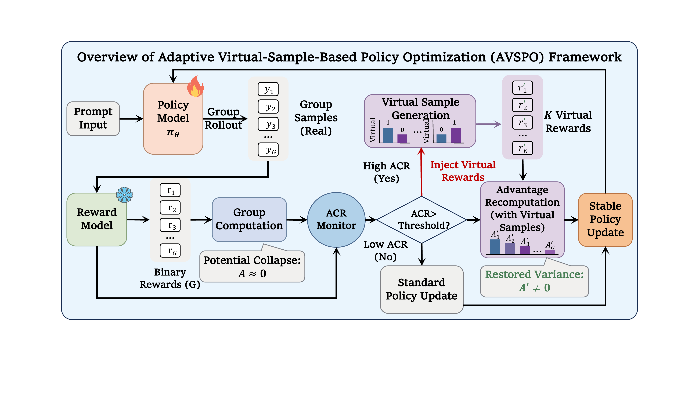
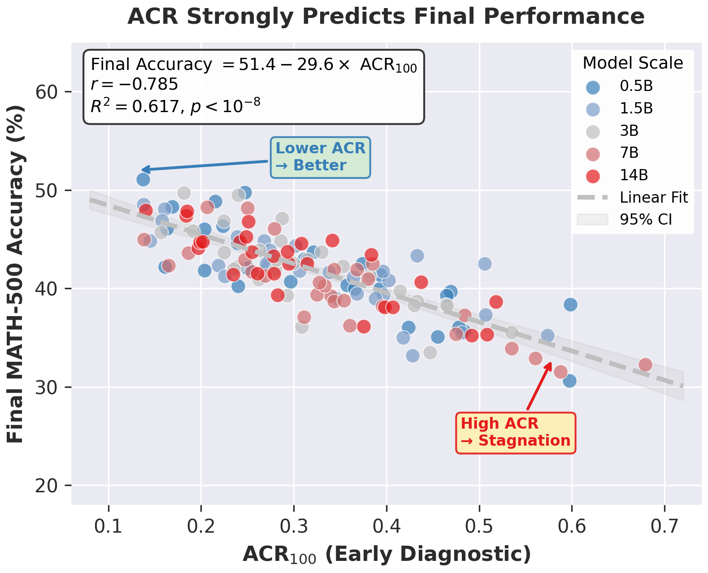

# Advantage Collapse in GRPO: Diagnosis and Mitigation

[]()
[](https://www.python.org/downloads/)
[](https://pytorch.org/)
[](LICENSE)

Official implementation for **"Advantage Collapse in Group Relative Policy Optimization: Diagnosis and Mitigation"** (ICML 2026).

## Abstract

Group Relative Policy Optimization (GRPO) has achieved strong results in improving the reasoning capabilities of large language models (LLMs). However, GRPO is prone to **advantage collapse**, a failure mode where homogeneous rewards within a group (e.g., all correct or all incorrect answers) yield near-zero advantages and vanishing gradients.

To address this, we introduce:
- **Advantage Collapse Rate (ACR)**: The first diagnostic metric quantifying the proportion of training batches with ineffective gradients
- **Adaptive Virtual Sample Policy Optimization (AVSPO)**: A lightweight extension of GRPO that injects virtual reward samples to enable learning from homogeneous groups

**Key Results:**
- ACR strongly predicts training stagnation and final performance (R² = 0.617)
- AVSPO reduces advantage collapse by **58-63%** relative to GRPO
- Consistent accuracy gains of **4-6 percentage points** across 0.5B-14B models

## Overview

<p align="center">
  
</p>

### The Advantage Collapse Problem

In GRPO, advantages are computed via intra-group normalization:

$$\hat{A}_i = \frac{r_i - \mu_{\mathcal{R}}}{\sigma_{\mathcal{R}} + \epsilon}$$

When all samples in a group receive identical rewards ($\sigma_{\mathcal{R}} = 0$), advantages collapse to zero, causing **vanishing gradients** despite valid feedback from the verifier.

### Our Solution: ACR + AVSPO

1. **ACR Monitoring**: Real-time detection of collapsed batches with zero computational overhead
2. **Virtual Sample Injection**: When collapse is detected, inject synthetic reward samples to restore gradient signal
3. **Adaptive Thresholding**: Dynamic intervention based on training progress

## Installation

### Requirements

- Python >= 3.8
- CUDA >= 12.0
- 4+ GPUs recommended

### Setup

```bash
# Clone repository
git clone https://github.com/hexixiang/ACR.git
cd ACR

# Install dependencies
pip install -r requirements.txt
```

### Key Dependencies

- `transformers>=4.56.2`
- `torch>=2.8.0`
- `accelerate>=1.10.1`
- `vllm>=0.10.2`
- `deepspeed>=0.17.6`
- `math-verify>=0.8.0`

## Repository Structure

```
.
├── trl_scope/                      # Core implementation
│   ├── trainer/
│   │   ├── grpo_trainer.py        # GRPO trainer with ACR monitoring & AVSPO
│   │   ├── grpo_config.py         # Training configuration
│   │   └── ...
│   ├── rewards/                    # Reward functions
│   │   ├── accuracy_rewards.py    # Correctness verification
│   │   └── ...
│   ├── scripts/
│   │   └── grpo.py                # Main training script
│   └── accelerate_configs/
│       └── zero3.yaml             # DeepSpeed ZeRO-3 config
├── data/
│   └── eval/
│       └── math500.jsonl          # Evaluation dataset
├── train_grpo.sh                   # Training launcher
└── requirements.txt
```

## Usage

### Training with AVSPO

```bash
bash train_grpo.sh
```

**Key Parameters:**

| Parameter | Description | Default |
|-----------|-------------|---------|
| `--model_name_or_path` | Base model | `Qwen/Qwen2.5-Math-1.5B` |
| `--num_generations` | Group size G | 8 |
| `--temperature` | Sampling temperature | 1.0 |
| `--learning_rate` | Learning rate | 1e-6 |
| `--use_vllm` | Enable vLLM acceleration | True |

### Training Script Example

```python
from trl_scope import GRPOTrainer, GRPOConfig
from trl_scope.rewards import box_accuracy_reward

# Configure training with AVSPO
config = GRPOConfig(
    output_dir="./output",
    per_device_train_batch_size=1,
    num_generations=8,              # Group size G
    temperature=1.0,
    learning_rate=1e-6,
    max_completion_length=1024,
    # AVSPO parameters
    use_avspo=True,
    acr_threshold_init=0.5,
    virtual_sample_alpha=0.5,
)

trainer = GRPOTrainer(
    model=model,
    args=config,
    reward_funcs=box_accuracy_reward,
    train_dataset=dataset,
)

trainer.train()
```

### Monitoring ACR

ACR is logged automatically during training. You can visualize it via:
- **WandB**: Check the `train/acr` metric
- **TensorBoard**: Track `acr` in the training logs

## Results

### Main Results

Performance comparison across model scales. All methods trained for 500 steps on Level3-500 with G=8, T=1.0.

| Model | Method | ACR↓ | MATH | GSM8K | Minerva | Olympiad | AMC | AIME | Avg. |
|-------|--------|------|------|-------|---------|----------|-----|------|------|
| **Qwen2.5-0.5B** | GRPO | 0.45 | 24.6 | 35.2 | 9.8 | 13.5 | 15.3 | 2.1 | 16.5 |
| | **AVSPO** | **0.18** | **31.4** | **44.8** | **13.2** | **17.9** | **20.1** | **3.5** | **21.0** |
| **Qwen2.5-3B** | GRPO | 0.37 | 36.8 | 52.6 | 15.3 | 22.4 | 24.8 | 5.9 | 27.9 |
| | **AVSPO** | **0.14** | **42.7** | **61.3** | **18.9** | **26.5** | **29.5** | **7.8** | **32.2** |
| **Qwen2.5-3B-Inst** | GRPO | 0.35 | 68.9 | 68.7 | 28.4 | 31.2 | 33.7 | 9.8 | 39.7 |
| | **AVSPO** | **0.13** | **73.6** | **75.8** | **31.2** | **35.1** | **37.4** | **12.3** | **43.4** |
| **Qwen2.5-Math-1.5B** | GRPO | 0.40 | 58.6 | 49.8 | 19.2 | 31.7 | 37.6 | 10.6 | 33.5 |
| | **AVSPO** | **0.15** | **67.2** | **59.3** | **28.9** | **37.8** | **41.6** | **14.2** | **39.6** |
| **Qwen2.5-Math-7B** | GRPO | 0.33 | 65.0 | 65.3 | 25.7 | 36.2 | 43.8 | 20.6 | 42.2 |
| | **AVSPO** | **0.14** | **74.1** | **69.7** | **29.4** | **43.6** | 40.9 | **23.2** | **45.9** |
| **Qwen2.5-14B** | GRPO | 0.28 | 72.5 | 71.8 | 32.1 | 44.6 | 48.2 | 23.8 | 49.9 |
| | **AVSPO** | **0.11** | **78.9** | **77.4** | **36.8** | **50.3** | **53.1** | **27.5** | **54.5** |

### ACR as a Predictive Metric

Early-stage ACR (first 100 steps) strongly predicts final performance:

- **Correlation**: r = -0.785 (p < 10⁻⁸)
- **R²**: 0.617 (62% variance explained)
- **Regression**: `Final Accuracy = 51.4 - 29.6 × ACR₁₀₀`

<p align="center">
  
</p>

### Ablation Studies

**Virtual Sample Construction Strategies:**

| Strategy | ACR↓ | MATH-500↑ |
|----------|------|-----------|
| No augmentation (GRPO) | 0.40 | 58.6 |
| Random uniform | 0.22 | 62.1 |
| Fixed partial (r=0.5) | 0.19 | 63.5 |
| Exponential decay | 0.18 | 64.2 |
| **Stratified (Ours)** | **0.15** | **67.2** |

**Adaptive vs Fixed Thresholding:**

| Threshold | Steps to 60% | Final Acc. |
|-----------|--------------|------------|
| Fixed τ=0.3 | 420 | 64.8% |
| Fixed τ=0.5 | 380 | 65.4% |
| Fixed τ=0.7 | 350 | 63.9% |
| **Adaptive** | **295** | **67.2%** |

## Citation

```bibtex
@inproceedings{anonymous2026acr,
  title={Advantage Collapse in Group Relative Policy Optimization: Diagnosis and Mitigation},
  author={Anonymous},
  booktitle={International Conference on Machine Learning (ICML)},
  year={2026}
}
```

## Acknowledgments

This work builds upon:
- [TRL](https://github.com/huggingface/trl) - Transformer Reinforcement Learning
- [DeepSeekMath](https://github.com/deepseek-ai/DeepSeek-Math) - GRPO algorithm
- [vLLM](https://github.com/vllm-project/vllm) - Fast inference engine
- [MATH Dataset](https://github.com/hendrycks/math) - Evaluation benchmark

## License

This project is released under the [Apache 2.0 License](LICENSE).
